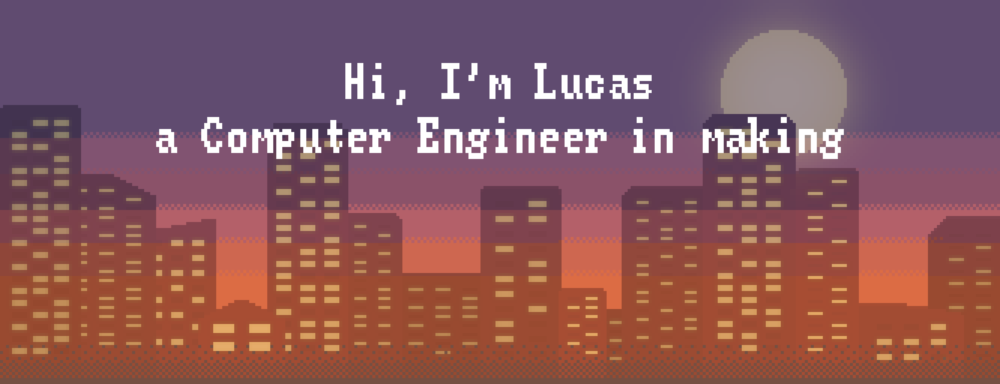

#   

**`Lucas Dalmau (student)`**  
I'm a computer engineer focused on information technology, eager to keep learning and growing in this fascinating world of coding and tech.  
From a young age, I've been passionate about technology and curious about the latest inventions. ✨  
Now i'm looking for new challenges and technologies to learn and grow as a computer engineer 💻📚

### 🧰 Skills
<!--backend--->

<!-- frontend-->

<!--others -->

  

### ⚒️ Tools that I use:

    
      
        
### 📊 Stats

<!--PUT HERE THE SNAKE GIF -->

  Visitor count 
  

